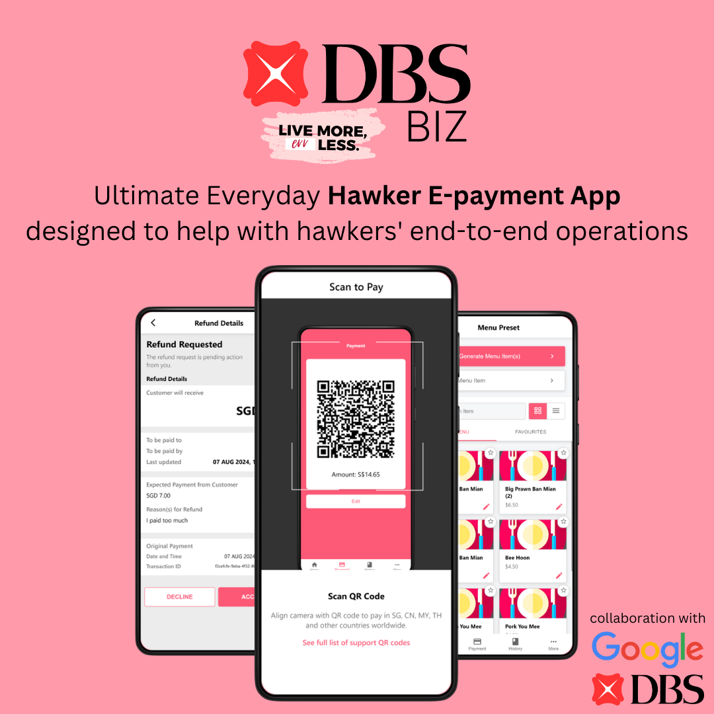
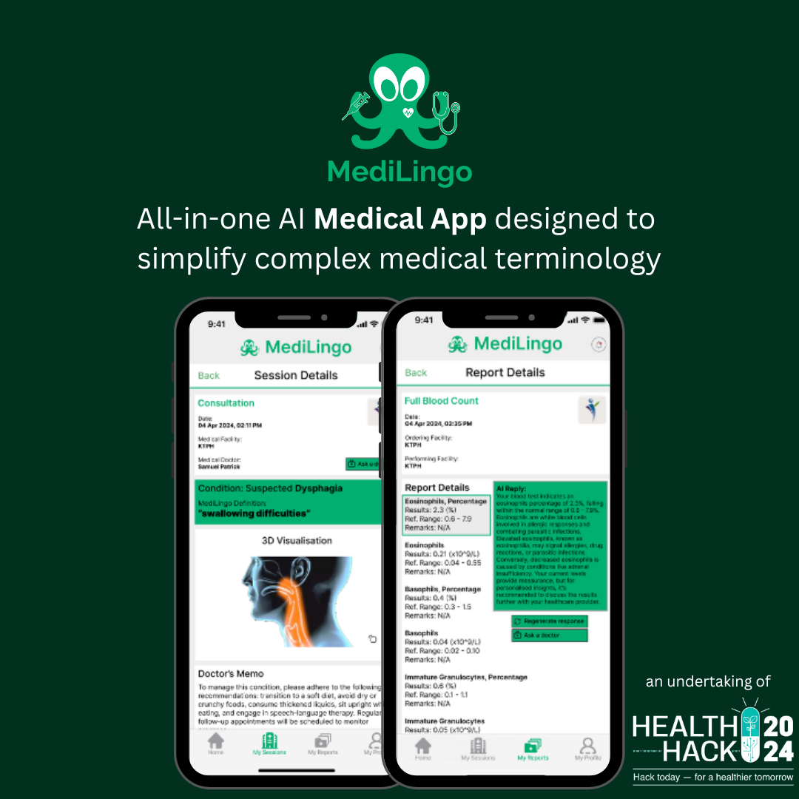
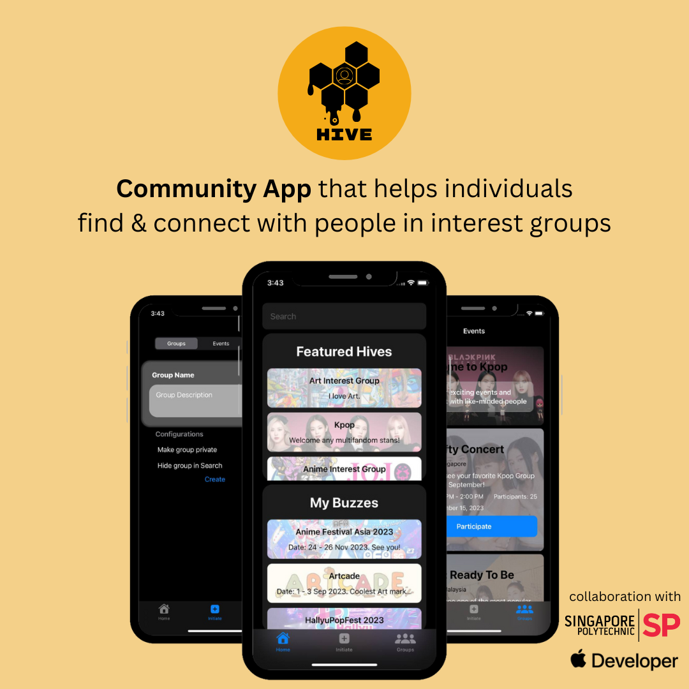

# <b>Hello, world. I'm <code>**Hun Chong**</code> ! 

## ⚡ About Me

⚙️ I’m an aspiring Data Scientist purusing a BSc in Artificial Intelligence and a Minor in Computer Science.  
👨‍💻 I am passionate about learning AI/ML and love to dabble with novel AI technologies.  
💬 "I learn AI to use AI more efficiently."  

 

## 🛠️ Languages and Tools

 

## 🏆 Hall of Fame
<table>
  <tr>
    <td></td>
    <td></td>
    <td></td>
  </tr>
  <tr>
    <td></td>
    <td></td>
    <td></td>
  </tr>
  <tr>
    <td></td>
    <td></td>
    <td></td>
  </tr>
</table>

## Honourable Mentions
1. <a href="https://github.com/zayne-siew/Stretch925">Stretch925</a>: App that utilises gamification and computer vision to promote a healthy stretching habit among corporate workers. *An undertaking of the LifeHack 2023.*
2. <a href="https://github.com/chaaaaun/wth-23">Ah Boy</a>: Innovative speech-to-text chatbot designed to be the ultimate digital sidekick for the seniors in Singapore - Supports Hokkien dialect! *An undertaking of What The Heck 2023.*
3. <a href="https://github.com/xpxchxcx/AquaGuardian">Aqua Guardians</a>: A cost-effective solution aimed to combat unlawful water pollution, especially in less developed countries. *An undertaking of the 2023 Google Solution Challenge.*
4. <a href="https://github.com/hunchongtan/MyToDoList">My To Do List</a>: A To Do List for dementia patients. *An undertaking of 10.014 Computational Thinking and Design (10.014).*
5. <a href="https://github.com/hunchongtan/Simple_Arduino_SwitchBot">Simple Arduino Switchbot</a>: A DIY SwitchBot with ESP32 Wi-Fi Module & intergated with Google Firebase. *An undertaking of a side project in 60.003 Product Design Studio.*
