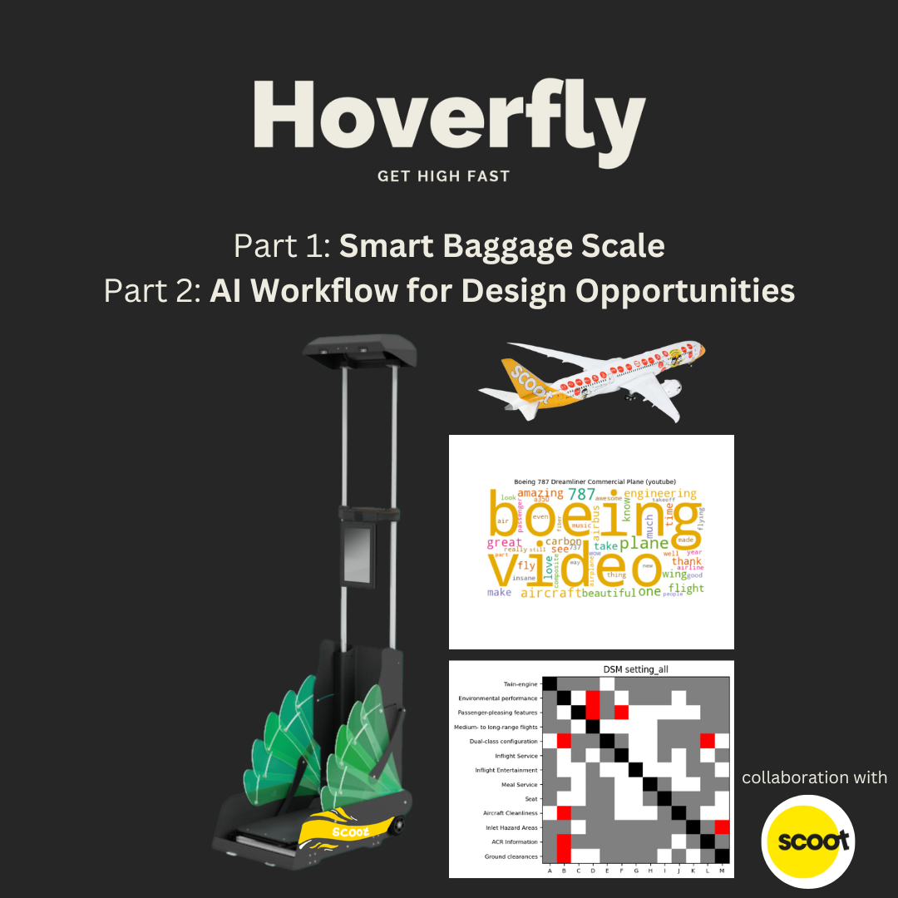
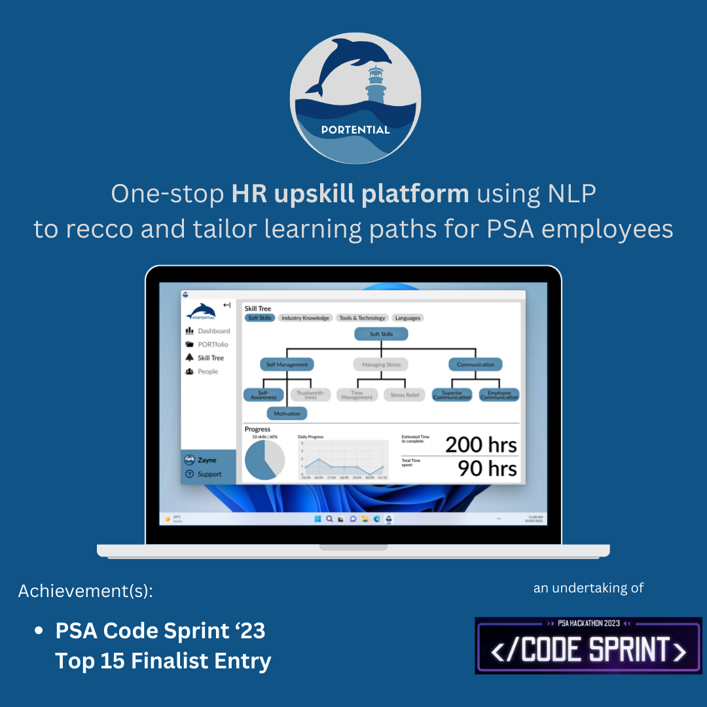

# <b>Hello, world. I'm <code>**Hun Chong**</code> ! 

## ⚡ About Me

⚙️ I’m an aspiring AI Engineer purusing a BSc in Artificial Intelligence.  
👨‍💻 I am passionate about learning AI/ML and love to dabble with novel AI technologies.  
💬 "I learn AI to use AI more efficiently."  

 

## 🛠️ Languages and Tools

 

## 🏆 Hall of Fame
<table>
  <tr>
    <td></td>
    <td></td>
    <td></td>
  </tr>
  <tr>
    <td></td>
    <td></td>
    <td></td>
  </tr>
  <tr>
    <td></td>
    <td></td>
    <td></td>
  </tr>
</table>
